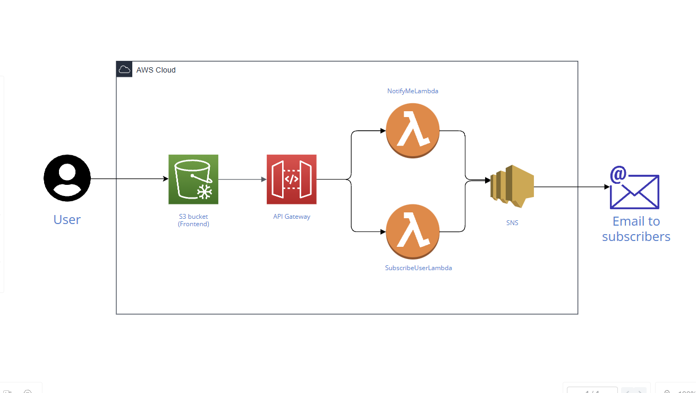
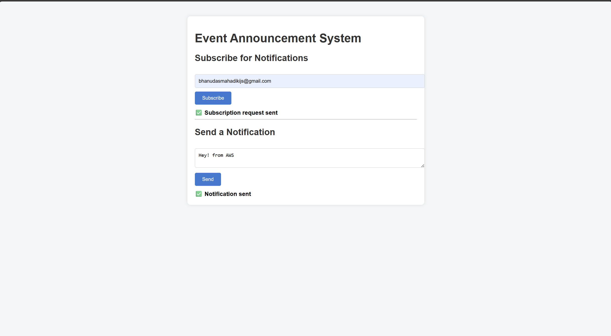
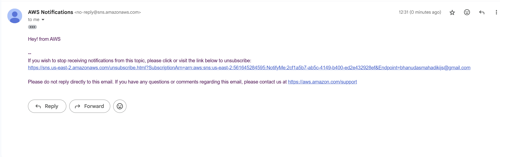

# Second Cloud Project - AWS-Event-Announcement-System

This repository contains a serverless Event Announcement System built using AWS. The application demonstrates how to integrate **S3**, **API Gateway**, **Lambda**, and **SNS** to create a scalable, multi-user notification platform.

# What I learned from the project-

- Learned how to build a fully serverless architecture using S3, API Gateway, Lambda, and SNS

- Gained hands-on experience with CORS configuration for API Gateway and S3-hosted frontend

- Built and tested a multi-user notification system with real-time email delivery
  
- Understood the difference between publishing to SNS and subscribing users via Lambda

## Architecture Diagram

## Final Result

## Components:

- **S3 Bucket**: Hosts the static frontend (HTML/CSS/JS)
- **API Gateway**: Routes requests to Lambda functions
- **NotifyMeLambda**: Publishes messages to SNS
- **SubscribeUserLambda**: Subscribes user emails to SNS
- **SNS Topic**: Sends email notifications to confirmed subscribers
- **IAM ROLE** : Allow Lambda to communicate with SNS

## Features

- Users can subscribe to notifications via email
- Admins can send announcements to all confirmed subscribers
- Fully serverless architecture—no EC2 or RDS involved
- Clean, responsive frontend hosted on S3

## Deployment Notes

- CORS configured for both endpoints
- IAM roles scoped to allow `sns:Publish` and `sns:Subscribe`
- Manual deployment used for learning; Terraform planned for v2
- Frontend updated via S3 uploads; backend via Lambda console

### Steps

1. **Create SNS Topic**  
   - Add your email as a subscriber and confirm it

2. **Create Lambda Functions**  
   - `NotifyMeLambda`: Publishes messages to SNS  
   - `SubscribeUserLambda`: Subscribes emails to SNS

3. **Set IAM Permissions**  
   - Grant `sns:Publish` and `sns:Subscribe` to respective Lambda roles

4. **Configure API Gateway**  
   - Create `/Nofity` and `/subscribe` endpoints  
   - Link each to its Lambda (POST + OPTIONS with CORS)

5. **Host Frontend on S3**  
   - Upload `index.html`, `style.css`, `script.js`  
   - Enable static website hosting and set public read access

6. **Wire Up Frontend**  
   - Add JS functions to call both endpoints  
   - Test subscription and notification flows

7. **Validate Everything**  
   - Confirm SNS emails  
   - Check Lambda logs  
   - Polish UI and diagram

## Security Considerations

This is a demo application and lacks production-grade security features:

- No authentication or authorization
- No HTTPS (S3 static hosting only)
- No input validation or sanitization
- No Secrets Manager integration
- No NACLs or WAF

This project helped me solidify my understanding of **event-driven architecture**, **SNS workflows**, using AWS. 

